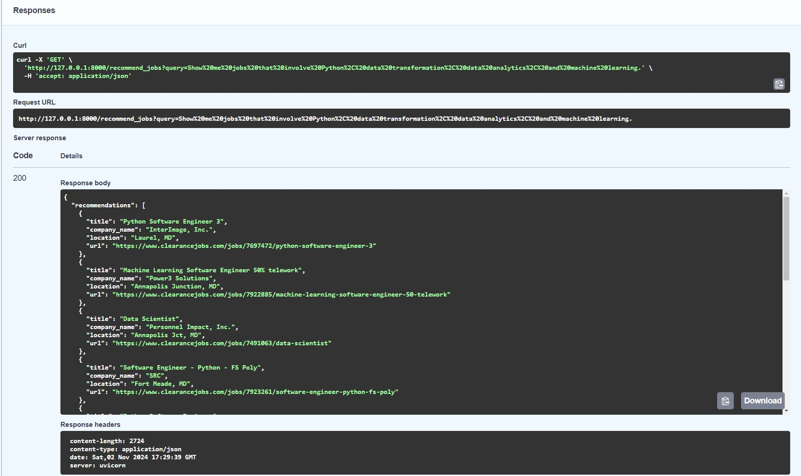

## Scraped Jobs LLM with RAG
An LLM with RAG helping me to find suitable job postings from a scraped dataset based on my query input (e.g. specific skills, location preferences).

## Tech used
* [FastAPI](https://fastapi.tiangolo.com/) - API endpoint for handling the user query.
* [SQLite](https://www.sqlite.org/) - Storing scraped jobs and job embeddings.
* [HuggingFace](https://huggingface.co/) - Supplies models for generating embeddings and an LLM.
* [FAISS](https://github.com/facebookresearch/faiss) - Vector similarity search.

## Demo Results
Example query: "Show me jobs that involve Python, data transformation, data analytics, and machine learning."

Example results:

## How to Install
<ol>
    <li>Create a venv and install with "pip install requirements.txt"</li>
    <li>Run the app with "uvicorn app:app --reload"</li>
    <li>Go to "http://127.0.0.1:8000/docs", expand the GET "recommend_jobs/" endpoint, click "Try it out"</li>
    <li>Enter your query and click "Execute" to view the response.</li>
</ol>
